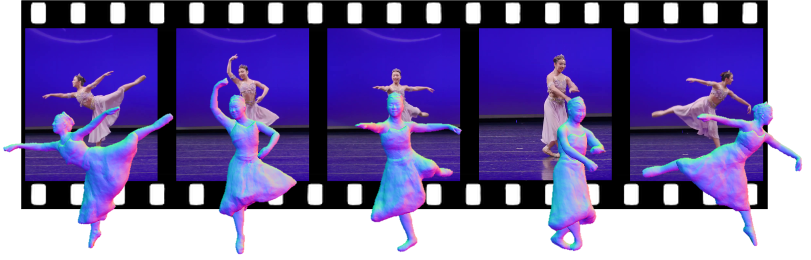
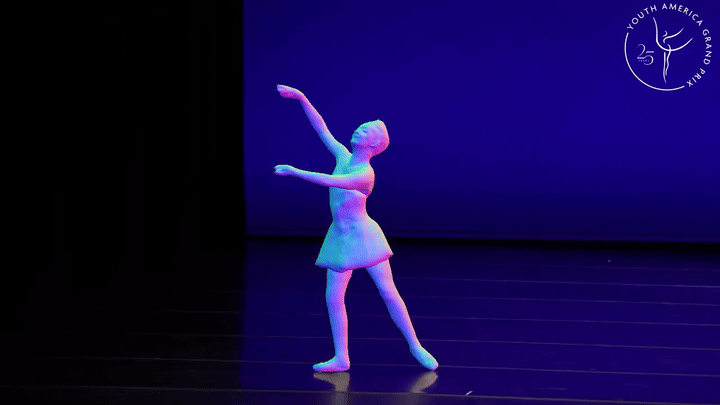
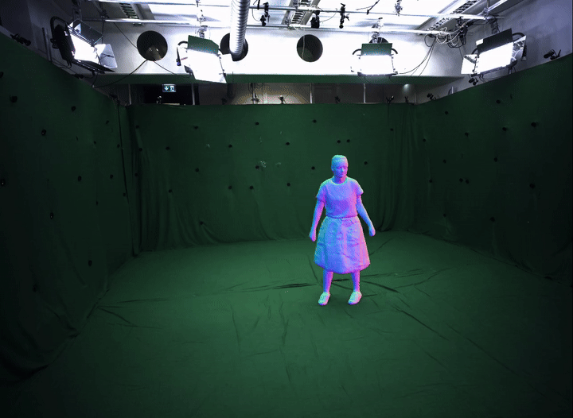
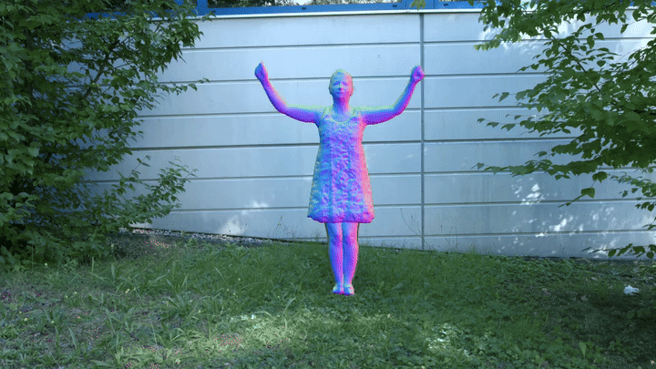

# ReLoo: Reconstructing Humans Dressed in Loose Garments from Monocular Video in the Wild

## [Paper](https://arxiv.org/pdf/2409.15269) | [Video Youtube](https://youtu.be/MSSDDk5p270) | [Project Page](https://moygcc.github.io/ReLoo/)

Official Repository for ECCV 2024 paper [*ReLoo: Reconstructing Humans Dressed in Loose Garments from Monocular Video in the Wild*](https://arxiv.org/abs/2409.15269).
<p align="center">
 
</p>

## Getting Started
* Clone this repo: `git clone https://github.com/eth-ait/ReLoo`
* Create a python virtual environment and activate. `conda create -n reloo python=3.10` and `conda activate reloo`
* Install dependenices. `cd ReLoo`, `pip install -r requirement.txt` and `cd code; python setup.py develop`
* Download [SMPL model](https://smpl.is.tue.mpg.de/download.php) (1.0.0 for Python 2.7 (10 shape PCs)) and move them to the corresponding places:
```
mkdir code/lib/smpl/smpl_model/
mv /path/to/smpl/models/basicModel_f_lbs_10_207_0_v1.0.0.pkl code/lib/smpl/smpl_model/SMPL_FEMALE.pkl
mv /path/to/smpl/models/basicmodel_m_lbs_10_207_0_v1.0.0.pkl code/lib/smpl/smpl_model/SMPL_MALE.pkl
```
## Download preprocessed demo data
You can quickly start trying out ReLoo with a preprocessed demo sequence including the pre-trained checkpoint. This can be downloaded from [Google drive](https://drive.google.com/drive/folders/1y4yzzqA9-5bwopkgCyn9h57eTQWnD68V?usp=sharing). Put this preprocessed demo data under the folder `data/` and put the folder `checkpoints` under `outputs/Dance_Game10/`.

## Training
```
cd code
bash train.sh
```
This will launch the trainig from scratch. You can also continue the training by changing the flag `is_continue` in the model config file `code/confs/model/model.yaml`. The training usually takes 24-48 hours. The validation results can be found at `outputs/`.

## Test
Run the following command to obtain the final outputs. By default, this loads the latest checkpoint.
```
cd code
bash test.sh
```

## Play on custom videos
To test on custom videos, please follow the data structure shown in the data folder of the demo video sequence. The official preprocessing scripts are coming soon.

<p align="center">
     
</p>

## Acknowledgement
We have used codes from other great research work, including [SDFStudio](https://github.com/autonomousvision/sdfstudio), [VolSDF](https://github.com/lioryariv/volsdf), [NeRF++](https://github.com/Kai-46/nerfplusplus), [SMPL-X](https://github.com/vchoutas/smplx), [Anim-NeRF](https://github.com/JanaldoChen/Anim-NeRF), [Vid2Avatar](https://github.com/MoyGcc/vid2avatar) and [SNARF](https://github.com/xuchen-ethz/snarf). We sincerely thank the authors for their awesome work!

## Related Works 
Here are more recent related human body reconstruction projects from our team:
* [Vid2Avatar-Pro](https://moygcc.github.io/vid2avatar-pro/)
* [MultiPly](https://eth-ait.github.io/MultiPly/)
* [Vid2Avatar](https://moygcc.github.io/vid2avatar)
* [X-Avatar](https://skype-line.github.io/projects/X-Avatar/)

If you find our code or paper useful, please cite as
```
@inproceedings{guo2024reloo,
      title={ReLoo: Reconstructing Humans Dressed in Loose Garments from Monocular Video in the Wild},
      author={Guo, Chen and Jiang, Tianjian and Kaufmann, Manuel and Zheng, Chengwei and Valentin, Julien and Song, Jie and Hilliges, Otmar},    
      booktitle = {European conference on computer vision (ECCV)},
      year      = {2024},
    }
```