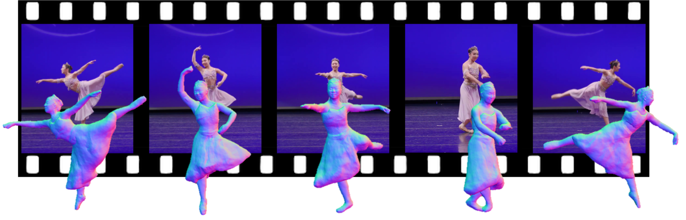

# ReLoo: Reconstructing Humans Dressed in Loose Garments from Monocular Video in the Wild

## [Paper](https://arxiv.org/pdf/2409.15269) | [Video Youtube](https://youtu.be/MSSDDk5p270) | [Project Page](https://moygcc.github.io/ReLoo/)

Official Repository for ECCV 2024 paper [*ReLoo: Reconstructing Humans Dressed in Loose Garments from Monocular Video in the Wild*](). 

 

Code release is delayed due to Chen’s ongoing internship at Meta but will be available in Dec.
